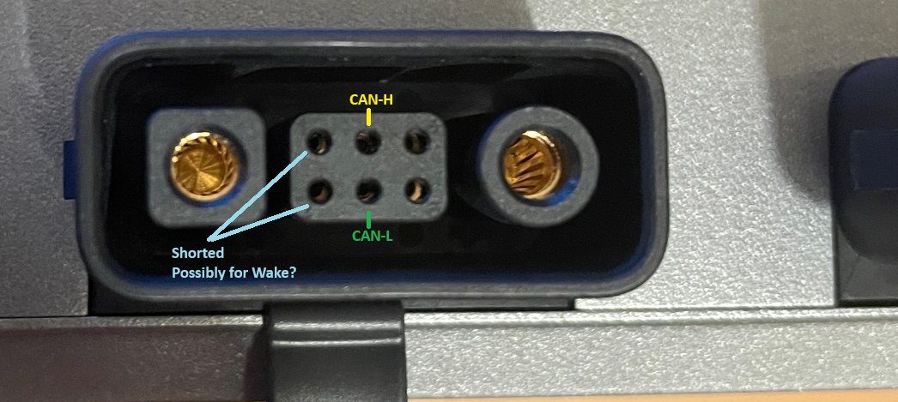

# EcoFlow CanBus Reverse Engineering
This repository is a scratchpad for reverse engineering the canbus protocol of the EcoFlow PowerStream with the intention of being able to enable the use of any battery via a telemetry transltion layer.

## Physical Layer

Work in progress

The ports on the PowerStream are difficult to identify while in circuit and without disassembly of the unit. Images i've gathered are from various sources across the internet of others that have disassembled broken units and are the starting points for trying to identify the purpose of each of the data pins.

The connector pins are unnumbered so for the purpose of research i'll be referencing them based on the above image from top left to bottom right.

1. Possible Wake Signal for battery - Shorted to Pin 4
2. Can High
3. Unknown or NC
4. Shorted to Pin 1
5. Can Low
6. Unknown or GND

