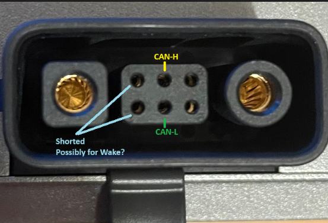
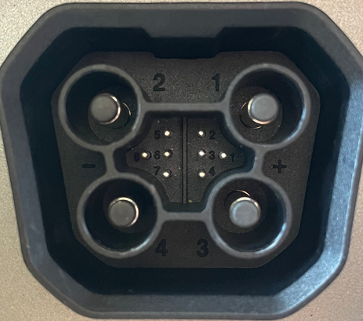

# EcoFlow CanBus Reverse Engineering
This repository is a scratchpad for reverse engineering the canbus protocol of the EcoFlow PowerStream with the intention of being able to enable the use of any battery via a telemetry translation layer.

## Physical Layer

Work in progress

The ports on the PowerStream are difficult to identify while in circuit and without disassembly of the unit. Images i've gathered are from various sources across the internet of others that have disassembled broken units and are the starting points for trying to identify the purpose of each of the data pins.

The connector pins are unnumbered so for the purpose of research i'll be referencing them based on the above image from top left to bottom right.

| Pin   | Function          |
| ---   | --------          |
| 1     | Wake?             |
| 2     | CAN-H             |
| 3     | ?                 |
| 4     | Short to Pin 1    | 
| 5     | CAN-L             |
| 6     | GND               |

EcoFlow LFP Battery Port (Probably Delta Pro too?)

| Data Pin   | Function          |
| ---   | --------          |
| 1     | CAN-H             |
| 2     | CAN-L             |
| 3     | ?                 |
| 4     | ?                 | 
| 5     | ?                 |
| 6     | ?                 |